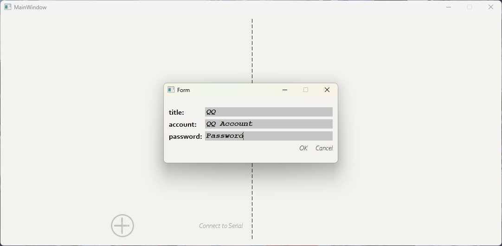
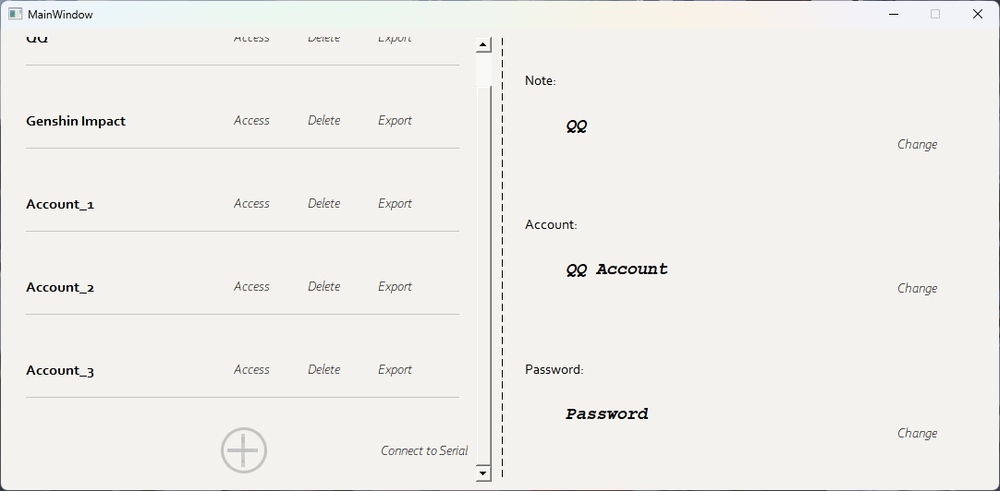
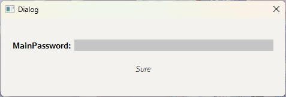
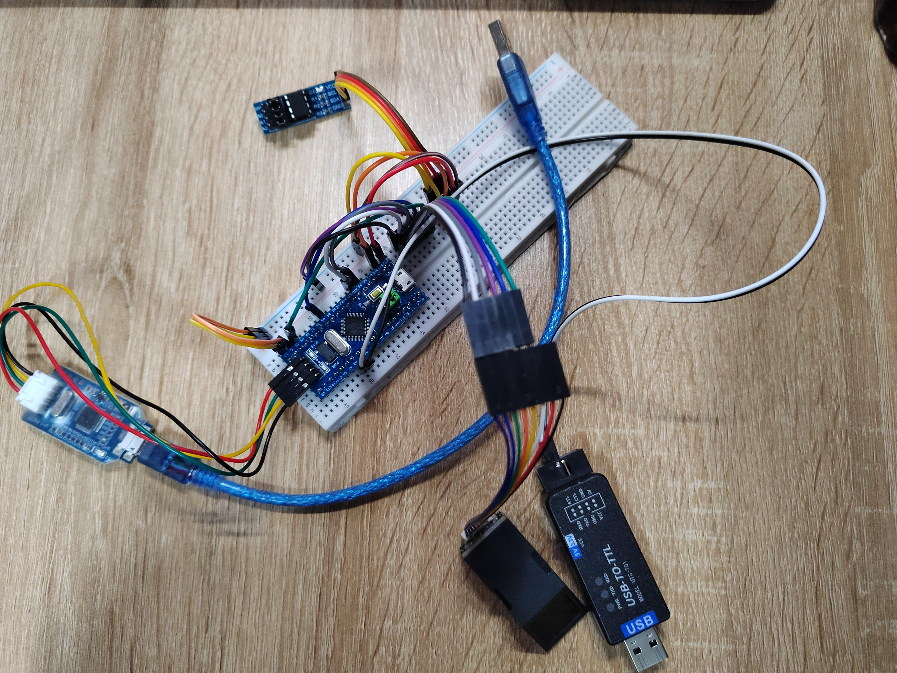

# PasswordManager

## 这是什么 

这个项目的核心功能基于 *Qt* 实现，重点是对日常生活中账户密码数据的加密存储与管理。每次启动应用时必须先输入主密码，程序会根据该主密码生成哈希值，所有后续的密码加密和解密操作都依赖于此哈希值。如果输入的主密码错误，解密后的密码数据也会出现错误，无法得到正确的密码。

在此基础上，项目还扩展了数据迁移与指纹验证功能。在 *GUI* 界面中点击对应密码项的 *Export*，就可将其通过串口将其传输至外部的嵌入式系统（基于 *STM32* + *FreeRTOS*）。密码数据存储在嵌入式系统的 *EEPROM* 中，并通过指纹验证机制进一步保护。只有在指纹验证成功的情况下，用户才能访问存储在 *EEPROM* 中的密码数据。

如果使用其它 *MCU* 的话，确保它的 *RAM* 不少于 *STM32C8T6*。

使用对应的指纹识别模块为 *AS608*, *EEPROM* 为 *AT24C256*，若使用其它模块，可能需要修改部分代码*（不会改很多）*。

## It Looks like...

<figure style = "text-align: center">
    
    <figcaption> 添加密码</figcaption>
</figure>

<figure style = "text-align: center">
    
    <figcaption> 访问密码</figcaption>
</figure>

<figure style = "text-align: center">
    
    <figcaption> 输入主密码</figcaption>
</figure>
<figure style = "text-align: center">
    
    <figcaption>如果想基于扩展部分进一步开发，至少需要这些东西</figcaption>
</figure>

*指纹模块*、*串口转TTL*、*EEPROM*，以及相应的开发环境。
